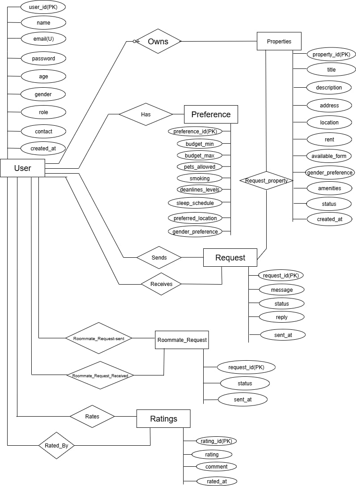
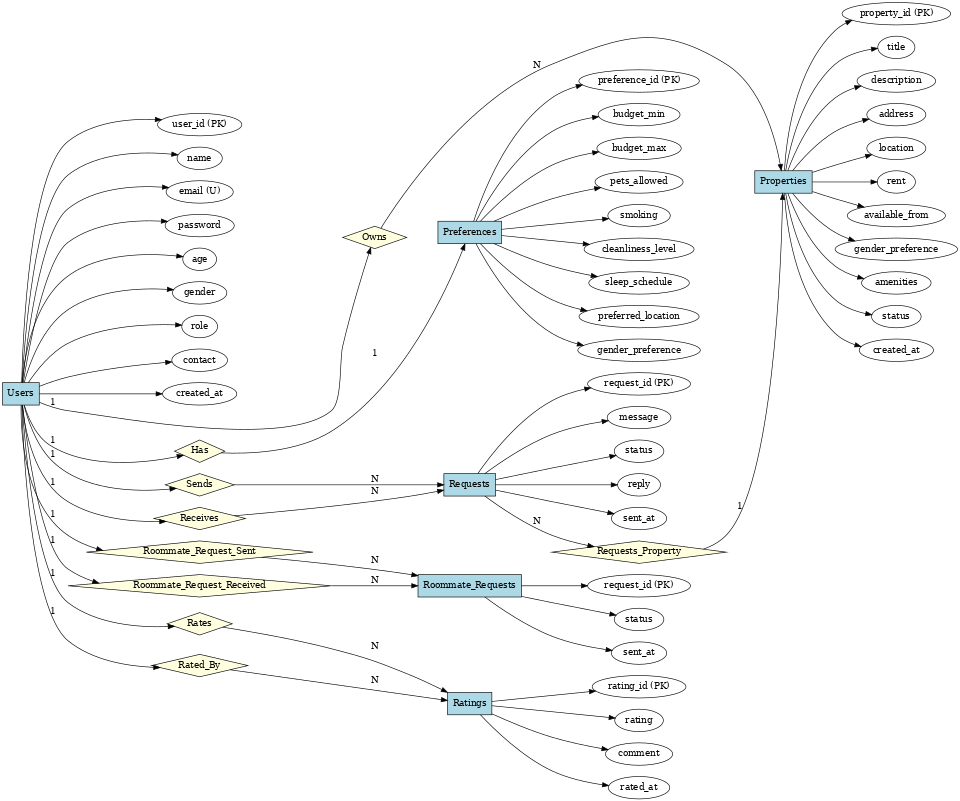

# Roommate & Rental Matching Platform 

---

## Project Overview

The **Roommate & Rental Matching Platform** is a comprehensive web application aimed at helping tenants and property owners connect efficiently. It facilitates finding suitable roommates and rental properties based on detailed user preferences like budget, gender, lifestyle habits, and location.

This platform supports:
- User management for tenants and owners with secure authentication.
- Property listing management including adding, editing, deleting, and browsing available rentals.
- Tenants specifying detailed roommate preferences such as smoking habits, pets, cleanliness, sleep schedules, and rent ranges.
- Sending and managing rental or roommate requests, with accept/reject workflows.
- A rating and review system to maintain trustworthy connections.
- Compatibility scoring and matching algorithm that recommends the best roommate or property fits.

---

## Objectives

- Design and implement a normalized MySQL database with proper foreign keys and constraints.
- Develop a dynamic PHP backend integrating CRUD operations, joins, triggers, and stored procedures.
- Implement a clean, user-friendly frontend with HTML/CSS for seamless interaction.
- Enable filtering and advanced matching through SQL queries.
- Provide a full request management and rating system to encourage reliable connections.

---

## Functionalities Implemented 🛠️ 

- User registration and login with role-based access (tenant or owner).
- Profile management for tenants and owners.
- Add, edit, delete rental properties by owners.
- Browse properties with filters for tenants.
- Tenant preference submission and updates.
- Sending and receiving roommate and rental requests.
- Accepting or rejecting requests with reply messages.
- Viewing sent and received requests in user dashboards.
- Rating and reviewing roommates and owners after stays.
- Compatibility scoring based on preferences and profiles.

---

## Database Tables Overview

Our project database consists of the following main tables:

- **users:** Stores user information such as name, email, hashed password, age, gender, role (tenant/owner), and contact details.

- **properties:** Contains rental listings posted by owners including title, description, address, location, rent, availability, gender preference, amenities, and status.

- **preferences:** Tenant roommate preferences including budget range, pets allowed, smoking habits, cleanliness level, sleep schedule, preferred location, and gender preference.

- **requests:** Rental connection requests sent by tenants to property owners, including messages and status tracking (pending, accepted, rejected).

- **roommate_requests:** Requests between tenants to connect as roommates, including status and timestamps.

- **ratings:** Stores ratings and comments given by users after stays, capturing reviewer, reviewed user, rating score, and review date.

These tables are related through foreign keys ensuring data integrity and supporting complex queries for matching and filtering.

---

## ER Diagrams 📊

### ER Diagram:

### ER Diagram (with cardinalities):

*Both ER diagrams are included in the repository as `rrdb_er_diagram.jpg` and `rrdb_er_diagram_with_cardinalities.png` respectively.*

---

## Video Demonstration 🎥

A comprehensive video showcasing the running project, all implemented functionalities, frontend and backend overview, and database design explanation is available at:

[https://youtu.be/ss-KB3MBHMQ](https://youtu.be/ss-KB3MBHMQ)

---

## Repository Files 📂

This repository contains:

- Source PHP files:  
`db.php`, `register.php`, `login.php`, `dashboard.php`, `logout.php`, `add_property.php`, `browse_properties.php`, `tenant_preference.php`, `edit_property.php`, `delete_property.php`, `send_request.php`, `view_requests.php`, `handle_request.php`, `my_requests.php`, `submit_rating.php`, `property_details.php`, `roommate_connection.php`, `tenant-tenant_send_request.php`, `tenant-tenant_view_requests.php`, `tenant-tenant_handle_request.php`, `tenant-tenant_my_requests.php`.

- Database files:  
  `roommate_rental_db.sql`

- ER diagram images:  
  `rrdb_er_diagram_with_cardinalities.png`  
  `rrdb_er_diagram.jpg`

- Other documentation:  
  `info.txt`

---

## How to Run

1. Import the SQL file `roommate_rental_db.sql` into your MySQL database.
2. Configure database credentials in `db.php`.
3. Place the project folder in your web server root (e.g., `htdocs` for XAMPP).
4. Access the project via `http://localhost/roommate_platform/` on your browser.
5. Register as tenant or owner and explore all features.

---

# Group Name  
## Team 07

## Team Members & Contributions 👨‍💻

| Name           | Student ID   | Contribution Summary                              |
|----------------|--------------|-------------------------------------------------|
| Zihan Manbit   | 231-115-028  | Backend development (database, PHP, logic), full PHP integration, as well as contributing to the frontend (UI design and integration). |
| Ashik Mahmud   | 231-115-002  | ER diagram and schema design, and contributed to the frontend UI design |
| Ashok Roy Antor| 231-115-040  | Contributed by creating fake data for testing and writing help text for UI fields. |

 
**Batch: CSE-58, Section A**

---

*Thank you for reviewing our project!*

